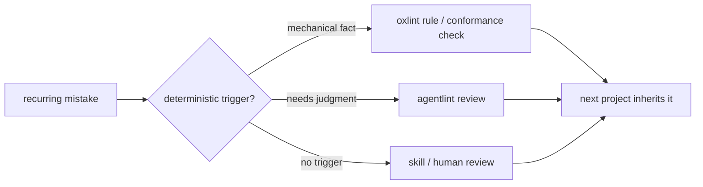

# Harness

**Lint rules, tool configs, conformance checks, and agent skills that steer TypeScript projects, so the same mistake is caught by a tool the second time.**



> [!NOTE]
> **Not on npm yet.** The 9 candidates publish through one manual, approval-gated workflow. See [release](docs/release-readiness.md).

## 18 packages, 3 maturity levels

```text
candidate  █████████        9  release candidates, consumer-tested
draft      █████████        9  private: 5 agentlint plugins, tanstack-query, cloudflare ×2, drizzle
parked     ███████          7  outside this repo: 4 Shopify theme pkgs, 2 Lit plugins, oio
```

| Package                           | Kind                                         |   Size | Status   |
| --------------------------------- | -------------------------------------------- | -----: | -------- |
| `oxlint-config`                   | preset                                       | config | ✅       |
| `oxfmt-config`                    | preset                                       | config | ✅       |
| `oxlint-plugin-core`              | rules · TypeScript                           |     15 | ✅       |
| `oxlint-plugin-effect`            | rules · Effect                               |     34 | ✅       |
| `oxlint-plugin-shopify-app`       | rules · Shopify apps & extensions            |     27 | ✅       |
| `oxlint-plugin-xstate`            | rules · XState                               |     11 | ✅       |
| `oxlint-plugin-type-evidence`     | rules · TS boundary & assertion contracts    |     10 | ✅       |
| `oxlint-plugin-tanstack-query`    | rules · gaps the official plugin misses      |      8 | 🧪 draft |
| `oxlint-plugin-cloudflare`        | rules · Workers, Durable Objects, Workflows  |      7 | 🧪 draft |
| `oxlint-plugin-drizzle`           | rules · Drizzle schemas                      |      1 | 🧪 draft |
| `agentlint-plugin-core`           | agent reviews · TypeScript                   |     24 | 🧪 draft |
| `agentlint-plugin-effect`         | agent reviews · Effect                       |      3 | 🧪 draft |
| `agentlint-plugin-tanstack-query` | agent reviews · TanStack Query               |      4 | 🧪 draft |
| `agentlint-plugin-shopify-app`    | agent reviews · Shopify                      |     15 | 🧪 draft |
| `agentlint-plugin-xstate`         | agent reviews · XState                       |      5 | 🧪 draft |
| `conformance-core`                | checks · any repo, Vitest adapter            |      5 | ✅       |
| `conformance-shopify-app`         | checks · Shopify app structure, Vitest suite |     13 | ✅       |
| `conformance-cloudflare`          | checks · Wrangler config, Hyperdrive         |      6 | 🧪 draft |

All names are scoped `@aurelienbbn/…`. Each package README ends with its generated rule/check inventory. Why drafts stay private: [compatibility](docs/compatibility.md).

## What goes where

```text
*-config / *-preset   bundle existing rules
*-plugin              new rule implementations
conformance-*         structural checks: manifests, layout, build output
```

- **Narrowest domain wins:** `effect` for Effect-only rules, `core` for stack-agnostic ones.
- **Autofix only when exactly one safe rewrite exists**, and it's tested. A fix needing project knowledge (e.g. picking an Effect Schema decoder) reports only.

## Commands

| Command                                        | What it proves                                                                       |
| ---------------------------------------------- | ------------------------------------------------------------------------------------ |
| `pnpm check`                                   | build, typecheck, lint, format, unit tests, policy + catalog gates                   |
| `pnpm test`                                    | rebuild, then unit tests (no watch mode: it tested stale `dist`)                     |
| `pnpm quality:check`                           | clean Knip report; production duplication ≤ 16-clone baseline                        |
| `pnpm test:coverage`                           | ratcheted coverage for config, agentlint, conformance code                           |
| `pnpm test:mutation`                           | mutation-tests the conformance-core kernel                                           |
| `pnpm security:check`                          | audits every dependency class; needs network, so separate in CI                      |
| `pnpm test:compatibility baseline` / `current` | installs the 9 packed candidates outside the workspace against public-registry tools |
| `pnpm test:package`                            | exercises all 18 packed packages, drafts included, via the local agentlint archive   |
| `pnpm release:plan`                            | versions, draft exclusions, blockers. Changes nothing; publishing is CI-only         |
| `pnpm catalog`                                 | regenerates rule/check inventories and credits (after build)                         |

**No `skipLibCheck`, no error allowlist.** Every consumer profile needs complete TypeScript declarations. Agentlint plugins still need the reviewed private archive and don't work with public agentlint 0.1.5: see the [agentlint contract](docs/agentlint-contract.md).

CI runs Linux + Windows on Node 22/24 plus the declared runtime floors. A configured matrix isn't a passed one: [local run evidence](docs/compatibility.md).

## Read next

| If you want…                        | Go to                                                                                        |
| ----------------------------------- | -------------------------------------------------------------------------------------------- |
| to add Harness to a project         | ask your agent to use the [install-harness](skills/install-harness/SKILL.md) skill           |
| the philosophy in one page          | [operating model](docs/operating-model.md)                                                   |
| what Harness owns vs upstream tools | [rule ownership](docs/rule-ownership.md)                                                     |
| Shopify App Store / BFS coverage    | [Shopify guide](docs/shopify.md)                                                             |
| the agent skills                    | [skills guide](docs/skills.md)                                                               |
| to contribute                       | [CONTRIBUTING](CONTRIBUTING.md) · [SECURITY](SECURITY.md) · [CODEOWNERS](.github/CODEOWNERS) |
| where the ideas came from           | [CREDITS](CREDITS.md)                                                                        |

**Agentlint doesn't score maintainability.** It schedules the spots where a human must decide, keeps the decision with its evidence, and reopens it when that evidence or the repo's review epoch changes.
