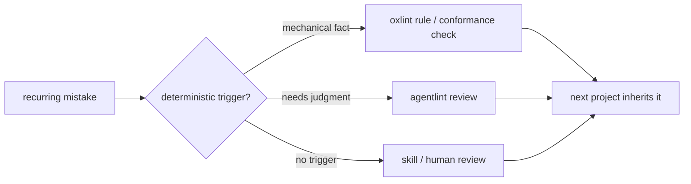

# Harness

[](https://github.com/aurelienbobenrieth/harness/actions/workflows/ci.yml) [](https://github.com/aurelienbobenrieth/harness/blob/main/LICENSE)

**Lint rules, tool configs, conformance checks, and agent skills that steer TypeScript projects, so the same mistake is caught by a tool the second time.**



> [!NOTE]
> **All 21 packages are release candidates.** They publish through one manual, approval-gated workflow. See [release](docs/release-readiness.md).

## 21 packages, all on npm

| Package                                                                       | Kind                                         |   Size | npm                                                                                                                                                                    |
| ----------------------------------------------------------------------------- | -------------------------------------------- | -----: | ---------------------------------------------------------------------------------------------------------------------------------------------------------------------- |
| [`oxlint-config`](packages/oxlint-config)                                     | preset                                       | config | [](https://www.npmjs.com/package/@aurelienbbn/oxlint-config)                                     |
| [`oxfmt-config`](packages/oxfmt-config)                                       | preset                                       | config | [](https://www.npmjs.com/package/@aurelienbbn/oxfmt-config)                                       |
| [`oxlint-plugin-core`](packages/oxlint-plugin-core)                           | rules · TypeScript                           |     16 | [](https://www.npmjs.com/package/@aurelienbbn/oxlint-plugin-core)                           |
| [`oxlint-plugin-effect`](packages/oxlint-plugin-effect)                       | rules · Effect                               |     35 | [](https://www.npmjs.com/package/@aurelienbbn/oxlint-plugin-effect)                       |
| [`oxlint-plugin-shopify-app`](packages/oxlint-plugin-shopify-app)             | rules · Shopify apps & extensions            |     27 | [](https://www.npmjs.com/package/@aurelienbbn/oxlint-plugin-shopify-app)             |
| [`oxlint-plugin-xstate`](packages/oxlint-plugin-xstate)                       | rules · XState                               |     11 | [](https://www.npmjs.com/package/@aurelienbbn/oxlint-plugin-xstate)                       |
| [`oxlint-plugin-type-evidence`](packages/oxlint-plugin-type-evidence)         | rules · TS boundary & assertion contracts    |     10 | [](https://www.npmjs.com/package/@aurelienbbn/oxlint-plugin-type-evidence)         |
| [`oxlint-plugin-tanstack-query`](packages/oxlint-plugin-tanstack-query)       | rules · gaps the official plugin misses      |      8 | [](https://www.npmjs.com/package/@aurelienbbn/oxlint-plugin-tanstack-query)       |
| [`oxlint-plugin-cloudflare`](packages/oxlint-plugin-cloudflare)               | rules · Workers, Durable Objects, Workflows  |      7 | [](https://www.npmjs.com/package/@aurelienbbn/oxlint-plugin-cloudflare)               |
| [`oxlint-plugin-drizzle`](packages/oxlint-plugin-drizzle)                     | rules · Drizzle schemas                      |      1 | [](https://www.npmjs.com/package/@aurelienbbn/oxlint-plugin-drizzle)                     |
| [`oxlint-plugin-alchemy`](packages/oxlint-plugin-alchemy)                     | rules · Alchemy runtimes                     |      4 | [](https://www.npmjs.com/package/@aurelienbbn/oxlint-plugin-alchemy)                     |
| [`agentlint-plugin-core`](packages/agentlint-plugin-core)                     | agent reviews · TypeScript                   |     24 | [](https://www.npmjs.com/package/@aurelienbbn/agentlint-plugin-core)                     |
| [`agentlint-plugin-effect`](packages/agentlint-plugin-effect)                 | agent reviews · Effect                       |      3 | [](https://www.npmjs.com/package/@aurelienbbn/agentlint-plugin-effect)                 |
| [`agentlint-plugin-tanstack-query`](packages/agentlint-plugin-tanstack-query) | agent reviews · TanStack Query               |      4 | [](https://www.npmjs.com/package/@aurelienbbn/agentlint-plugin-tanstack-query) |
| [`agentlint-plugin-shopify-app`](packages/agentlint-plugin-shopify-app)       | agent reviews · Shopify                      |     15 | [](https://www.npmjs.com/package/@aurelienbbn/agentlint-plugin-shopify-app)       |
| [`agentlint-plugin-xstate`](packages/agentlint-plugin-xstate)                 | agent reviews · XState                       |      5 | [](https://www.npmjs.com/package/@aurelienbbn/agentlint-plugin-xstate)                 |
| [`agentlint-plugin-alchemy`](packages/agentlint-plugin-alchemy)               | agent reviews · Alchemy stacks               |      6 | [](https://www.npmjs.com/package/@aurelienbbn/agentlint-plugin-alchemy)               |
| [`conformance-core`](packages/conformance-core)                               | checks · any repo, Vitest adapter            |      5 | [](https://www.npmjs.com/package/@aurelienbbn/conformance-core)                               |
| [`conformance-shopify-app`](packages/conformance-shopify-app)                 | checks · Shopify app structure, Vitest suite |     13 | [](https://www.npmjs.com/package/@aurelienbbn/conformance-shopify-app)                 |
| [`conformance-cloudflare`](packages/conformance-cloudflare)                   | checks · Wrangler config, Hyperdrive         |      6 | [](https://www.npmjs.com/package/@aurelienbbn/conformance-cloudflare)                   |
| [`conformance-alchemy`](packages/conformance-alchemy)                         | checks · Alchemy state, CI, previews         |      4 | [](https://www.npmjs.com/package/@aurelienbbn/conformance-alchemy)                         |

All names are scoped `@aurelienbbn/…`. Parked outside this repo until a later release: 4 Shopify theme packages, 2 Lit plugins, `oio`. Each package README ends with its generated rule/check inventory. Tested hosts and ranges: [compatibility](docs/compatibility.md).

## What goes where

```text
*-config / *-preset   bundle existing rules
*-plugin              new rule implementations
conformance-*         structural checks: manifests, layout, build output
```

- **Narrowest domain wins:** `effect` for Effect-only rules, `core` for stack-agnostic ones.
- **Autofix only when exactly one safe rewrite exists**, and it's tested. A fix needing project knowledge (e.g. picking an Effect Schema decoder) reports only.

## Commands

| Command                                        | What it proves                                                                        |
| ---------------------------------------------- | ------------------------------------------------------------------------------------- |
| `pnpm check`                                   | build, typecheck, lint, format, unit tests, policy + catalog gates                    |
| `pnpm test`                                    | rebuild, then unit tests (no watch mode: it tested stale `dist`)                      |
| `pnpm quality:check`                           | clean Knip report; production duplication ≤ 16-clone baseline                         |
| `pnpm test:coverage`                           | ratcheted coverage for config, agentlint, conformance code                            |
| `pnpm test:mutation`                           | mutation-tests the conformance-core kernel                                            |
| `pnpm security:check`                          | audits every dependency class; needs network, so separate in CI                       |
| `pnpm test:compatibility baseline` / `current` | installs the 21 packed candidates outside the workspace against public-registry tools |
| `pnpm test:package`                            | exercises all 21 packed packages with the registry agentlint engine                   |
| `pnpm release:plan`                            | versions, draft exclusions, blockers. Changes nothing; publishing is CI-only          |
| `pnpm catalog`                                 | regenerates rule/check inventories and credits (after build)                          |

**No `skipLibCheck`, no error allowlist.** Every consumer profile needs complete TypeScript declarations. Agentlint plugins run on the public engine `@aurelienbbn/agentlint` 0.3.x: see the [agentlint contract](docs/agentlint-contract.md).

CI runs Linux + Windows on Node 22/24 plus the declared runtime floors. A configured matrix isn't a passed one: [local run evidence](docs/compatibility.md).

## Read next

| If you want…                        | Go to                                                                                        |
| ----------------------------------- | -------------------------------------------------------------------------------------------- |
| to add Harness to a project         | ask your agent to use the [install-harness](skills/install-harness/SKILL.md) skill           |
| the philosophy in one page          | [operating model](docs/operating-model.md)                                                   |
| what Harness owns vs upstream tools | [rule ownership](docs/rule-ownership.md)                                                     |
| Shopify App Store / BFS coverage    | [Shopify guide](docs/shopify.md)                                                             |
| the agent skills                    | [skills guide](docs/skills.md)                                                               |
| to contribute                       | [CONTRIBUTING](CONTRIBUTING.md) · [SECURITY](SECURITY.md) · [CODEOWNERS](.github/CODEOWNERS) |
| where the ideas came from           | [CREDITS](CREDITS.md)                                                                        |

**Agentlint doesn't score maintainability.** It schedules the spots where a human must decide, keeps the decision with its evidence, and reopens it when that evidence or the repo's review epoch changes.
