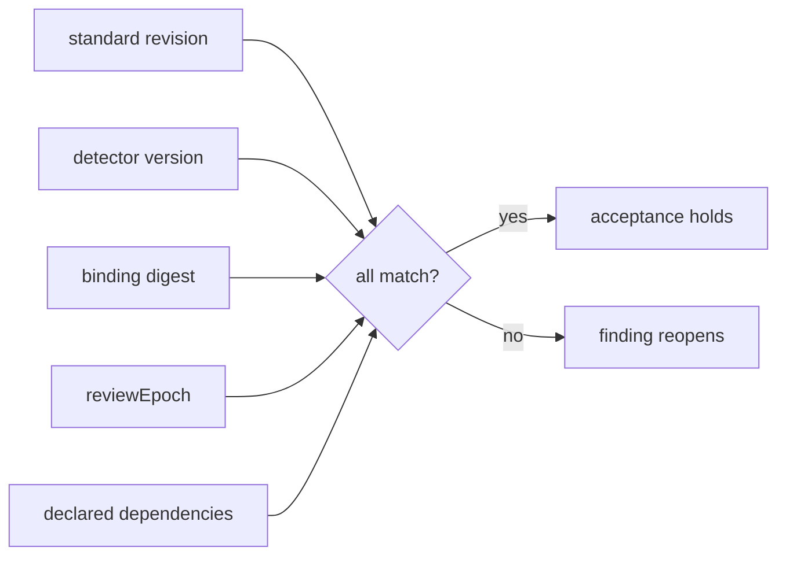

# Agentlint contract

**The 5 agentlint plugins target the standard / detector / binding API of the public engine `@aurelienbbn/agentlint` 0.3.x.** Breaking migration from the 0.1 engine: no adapter for the former flat rules, object-map config, or ledger records.

> [!NOTE]
> **Peer `>=0.3.0 <0.4.0`, developed against 0.3.0.** 0.3.0 rejects a config where two rules share a standard id but disagree on its revision, title, summary, source, or guidance (`ConfigError` reason `conflicting_standard`). Every preset, alone and all 5 composed, loads cleanly.

## An acceptance holds only while its inputs match



**Rules bump their own versions; the repository owns bindings, authority, and `reviewEpoch`. The engine uses no clock.**

<details>
<summary>Lever owners and execution rules</summary>

| Lever               | Owner      | Rule                                                                                                                           |
| ------------------- | ---------- | ------------------------------------------------------------------------------------------------------------------------------ |
| standard revision   | rule       | Starts at `1`. Bump when meaning changes after adoption.                                                                       |
| detector version    | rule       | Starts at `1`. Bump when detection changes after adoption.                                                                     |
| binding             | repository | Arrays or `extends`; unique ids. Repository owns scope and authority. Mechanically evidenced rules may allow agent acceptance. |
| binding digest      | engine     | Includes factory options: regex source/flags, array order. Factories snapshot options.                                         |
| `reviewEpoch`       | repository | Bump to invalidate compatible decisions when a policy period changes. **No clock.**                                            |
| declared dependency | rule       | `registry-drift` declares its registry file: complete evidence required; registry change reopens.                              |

Evidence fingerprint and sufficient authority must also match. **Architectural and invariant trade-offs default to human authority.**

- `scan: "file"` is opt-in for file-local visitors.
- Missing or malformed registry evidence **fails**, never skips.
- Stateful regex patterns restart for each match.
- `relatedFiles`: declared dependencies or files from the normalized change, carried as reading context, never correctness evidence.

</details>

## Every rule is a review prompt, never a verdict

| Rules                                                                                                                           | Limit                                                                                  |
| ------------------------------------------------------------------------------------------------------------------------------- | -------------------------------------------------------------------------------------- |
| core `abstraction-earns-keep`                                                                                                   | Adapters, tracing, runtime boundaries justify delegation; a name proves nothing.       |
| core `boundary-resilience`                                                                                                      | Name matching misses wrappers and import aliases.                                      |
| core `bounded-data-access` (data-access code)                                                                                   | A cursor/filter alone doesn't prove bounded cardinality.                               |
| core `bounded-work` (execution paths)                                                                                           | Syntactic prompt, not a complexity proof. Skips strings/comments.                      |
| core `comment-signal` (optional)                                                                                                | Keeps type-only JSDoc and constraint docs.                                             |
| core `change-scatter-review`, `single-use-extraction-review`, `precision-boundary-review` (opt-in, human)                       | Call counts, repeated tokens, unit suffixes: evidence, not verdicts.                   |
| core `protected-invariant-change`, `hotspot-change-review` (opt-in, human)                                                      | Repository config; **empty defaults = no findings**.                                   |
| core `test-behavior-coverage` (tests)                                                                                           | File-level mock/assertion density, not coverage.                                       |
| effect `prefer-schema-contracts`                                                                                                | Runtime trust, persistence, wire only; helper types stay compile-time.                 |
| tanstack-query `query-state-coverage`, `mutation-state-coverage`                                                                | Boundaries can own query states. Mutations: pending, error, retry, duplicate, offline. |
| xstate `actor-cleanup`, `derived-boolean-context`, `machine-failure-coverage`                                                   | Lexical: can't prove lifecycle, reachability, guards.                                  |
| shopify-app `action-label-clarity`, `banner-usage`, `destructive-action-review`, `form-error-recovery`, `modal-workflow-review` | Configured App Home only; browser evidence proves interaction.                         |
| shopify-app `no-pressure-copy`, `review-solicitation`                                                                           | Partial lexicons; neutral asks still need placement review.                            |
| shopify-app `session-token-auth`, `settings-save-bar`, `checkout-network-discipline`                                            | Draft UI storage ≠ stored identity.                                                    |
| shopify-app `app-ux-review` (opt-in)                                                                                            | **Empty route targets = no findings.**                                                 |

## Clean checkouts install the engine from npm

`@aurelienbbn/agentlint` 0.3.0 is each plugin's exact devDependency; [`policy/compatibility.json`](../policy/compatibility.json) pins the same version in both tool profiles.

```text
 @aurelienbbn/agentlint 0.3.0 (npm)
   ├─▶ plugin tests ........ typed builds, rule tests, real-parser fixtures  (pnpm check)
   ├─▶ package consumer .... all 18 packed packages, fresh install          (pnpm test:package)
   └─▶ registry profiles ... 18 candidates, public registry, strict peers   (pnpm test:compatibility baseline|current)
```

Both consumers run the agentlint suite: all 5 presets in one typed config, every rule's fixtures, and the CLI (`check`, `init --preset`, `rules test`, `next`) across all 5 domains.

**Engine upgrade:** bump the dev engine and both profiles together → widen the peer range only with evidence → rerun both consumers.

<details>
<summary>What validation proves, and what it doesn't</summary>

Package consumer packs only `packages/*` (private root excluded). Passes: fresh pnpm install, dependency audit, strict TypeScript (no `skipLibCheck`, no declaration exemption), runtime exports, lint runners, scaffold checks. The engine and harness share Effect and both Node platform packages at `4.0.0-rc.115`.

Validation: typed builds, rule tests, real-parser positive/negative fixtures, configured-route integration, option identity/determinism, registry dependency invalidation, the CLI's current JSONL envelope.

Establishes applicability to the current code/API. Does **not** establish renewed Shopify certification, exhaustive external policy compliance, or that historical results certify this graph.

Rule details: `bounded-work` separates nested routines and preserves I/O callbacks when inspecting fan-out. `tanstack-query` mutation review also covers success.

</details>
