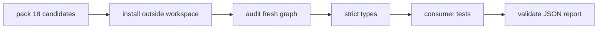

# Consumer compatibility

**18 release candidates pass as fresh registry consumers on two pinned tool profiles.** Evidence for the specified consumers, not certification of every downstream project.

```text
candidate  ██████████████████  18  public release candidates, tested as registry consumers
draft                           0
parked     ███████              7  outside this repo: 4 Shopify theme pkgs, 2 Lit plugins, oio
```

## Every host has a floor and a tested ceiling

Source of truth: [policy/compatibility.json](../policy/compatibility.json). ESM only, Node `^22.19.0 || ^24.11.0` (floor set by the agentlint CLI's Undici dependency).

| Host            | Declared support    | `baseline` | `current` |
| --------------- | ------------------- | ---------- | --------- |
| agentlint       | `>=0.3.0 <0.4.0`    | 0.3.0      | 0.3.0     |
| oxlint          | `>=1.82.0 <2.0.0`   | 1.82.0     | 1.83.0    |
| oxlint-tsgolint | `^7.0.2001`         | 7.0.2001   | 7.0.2002  |
| oxfmt           | `>=0.67.0 <0.69.0`  | 0.67.0     | 0.68.0    |
| vite-plus       | `^0.3.2`            | 0.3.2      | 0.3.2     |
| Vitest          | `>=4.1.11 <6.0.0`   | 4.1.11     | 5.0.1     |
| Stylelint       | `>=17.15.0 <18.0.0` | 17.15.0    | 17.15.0   |

Both pin TypeScript 7.0.2 · Vite 8.3.0 · `@types/node` 22.20.3 · Lit 3.3.3 · XState 5.33.2 · jsdom 30.1.0.

- **`baseline`**: the toolchain Vite Plus 0.3.2 bundles.
- **`current`**: reviewed versions in the supported families, **never a floating dist-tag**. Runs conformance adapters on Vitest 5.
- New Node majors and unlisted pre-1.0 families need review before a range changes.

<details>
<summary>Registry sources, pending upgrades, host types</summary>

- Checked against the public npm registry on 2026-09-24 (matches `registryCheckedAt`): [agentlint](https://registry.npmjs.org/@aurelienbbn%2Fagentlint/0.3.0), [oxlint](https://registry.npmjs.org/oxlint/1.83.0), [Vite Plus](https://registry.npmjs.org/vite-plus/0.3.2), [Vitest](https://registry.npmjs.org/vitest/5.0.1), [Stylelint](https://registry.npmjs.org/stylelint/17.15.0).
- Newer, not adopted (2026-09-24): oxlint 1.85.0, oxfmt 0.70.0 (outside `<0.69.0`), Vite Plus 0.3.3 and 1.0.0-rc.0, jsdom 30.1.1.
- Parked `conformance-shopify-theme` keeps TypeScript 6.0.3 at runtime: TypeScript 7 drops the compiler API it uses to resolve event names.
- Config packages import host types from `oxlint` and `oxfmt`. Vite+ re-exports them, so the same objects work in its `lint` and `fmt` fields without Vite+ in either peer contract.

</details>

## Five commands reproduce the evidence

**Build first: packing reuses the artifacts `pnpm check` just validated.**

```sh
pnpm check
pnpm test:compatibility baseline
pnpm test:compatibility current
pnpm test:package
pnpm security:check
```

Each registry profile, then deletes its temporary consumer:



**The workspace's clean audit proves nothing about the consumer** (different aliases and transitive resolutions); a consumer audit failure fails the command. Candidates come from [release policy](../policy/release.json).

- ✅ strict peers and engines, installed direct versions checked
- ❌ no automatic peer install, lifecycle scripts, overrides, or local archives: the agentlint engine comes from npm like every other host
- ⚠️ transitive deps follow upstream manifests: fresh-install test, not a locked replay

**One profile:** 18 archives · every public export · licenses + READMEs · complete declarations with `skipLibCheck: false` · 0 skips. Every runner/check gets passing and failing input, across: all 5 agentlint presets composed in one typed config with every rule's own fixtures, the agentlint CLI (`check` on broken and clean input, `init --preset` with all 5 starter presets, `rules test`, `next`), all oxlint plugins in one policy, the Shopify App Home recipe, the formatter config, strict type-aware lint (real oxlint-tsgolint assignment diagnostic, clean after the fix), both conformance APIs, and the closed-design-system example (**API wiring only; Tailwind build not run**).

**A green exit code isn't enough.** Commands parse Vitest's JSON report and fail on a missing test file, unexecuted passes, unfinished or unexpected skips, or any skip in a registry profile. The package consumer allows each of its 4 named core exclusions once, in the original acceptance suite. 6 regression cases guard this.

## Evidence: 24 advisories → 0, all runs local Windows x64

```text
2026-09-05 audit      ████████████████████████  24
remediated lockfile   ░                          0
```

**CI adds Linux and newer-patch evidence only when it actually runs: a configured workflow is not a passed workflow.**

<details>
<summary>Run log, advisories, 2026-09-21 package run</summary>

| When              | What ran                                                                         | Result                                                                  |
| ----------------- | -------------------------------------------------------------------------------- | ----------------------------------------------------------------------- |
| before 2026-09-05 | both profiles × Node 22.18.0, 24.11.0, 24.15.0 on Vite Plus 0.2.1 / Vitest 4.1.9 | ✅ 6/6, 6 tests, 0 skips. Historical: doesn't validate current contract |
| 2026-09-05        | full dependency audit                                                            | ❌ 24 advisories, incl. critical browser-runner file access             |
| 2026-09-05        | remediated lockfile                                                              | ✅ 0 known advisories, all categories                                   |
| after remediation | patched profiles × Node 22.19.0, 24.11.0, 24.15.0                                | ✅ 6/6: fresh audit, strict declarations, 6 tests, 0 skips              |
| after remediation | draft consumer                                                                   | ✅ fresh audit, 26 tests, 3 approved skips                              |
| 2026-09-21        | `pnpm test:package`, all 15 active packages                                      | ✅ below                                                                |

Historical minimum-version runs (22.18.0, 24.11.0) used official portable Node archives verified against published SHA-256 checksums.

| Package                 | Advisory                                                                 | Fixed at                                   |
| ----------------------- | ------------------------------------------------------------------------ | ------------------------------------------ |
| Vitest (browser runner) | [file access](https://github.com/advisories/GHSA-p63j-vcc4-9vmv)         | Vitest 4.1.10 / Vite Plus 0.2.4, first fix |
| PostCSS                 | [source maps](https://github.com/advisories/GHSA-fxqj-rqcc-2cmp)         | 8.5.23 (direct)                            |
| smol-toml               | [recursion](https://github.com/advisories/GHSA-v3rj-xjv7-4jmq)           | 1.6.1 (direct)                             |
| Undici                  | [cache handling](https://github.com/advisories/GHSA-4cwx-7wf7-3272)      | 8.10.2 (transitive)                        |
| TOML                    | [recursion](https://github.com/advisories/GHSA-82x6-q7mm-w9cf)           | 4.3.0 (transitive)                         |
| nanoid                  | [zero sizes](https://github.com/advisories/GHSA-2v37-7h3g-55p8)          | 3.3.18 (transitive)                        |
| js-yaml                 | [resource exhaustion](https://github.com/advisories/GHSA-5p4m-2wfm-xmqj) | 3.15.2 / 4.3.2 (transitive)                |
| fast-uri                | [normalization](https://github.com/advisories/GHSA-f65p-4m7j-42xc)       | 3.1.7 (transitive)                         |

No advisory IDs ignored; no security override forces a dependency across a major. The baseline has since moved to Vite Plus 0.3.2 / Vitest 4.1.11. `pnpm security:check` needs registry access, so it stays out of the deterministic local check. An empty report means no known findings today, not no vulnerabilities.

**2026-09-21 `pnpm test:package`:** packs only `packages/*` (private root excluded). ✅ fresh install · dependency audit · strict TypeScript · 17 runtime exports · both lint runners · 20 tests. 4 explicit skips a minimal consumer can't or doesn't configure: dead exports, duplication budget, CSS build probe, TypeScript strictness. Agentlint archive and harness share `effect` and both Node platform packages at `4.0.0-rc.115`. No `skipLibCheck`, no declaration exemption.

</details>

## Agentlint engine

**The 5 agentlint plugins peer on `@aurelienbbn/agentlint` `>=0.3.0 <0.4.0` and develop against exactly 0.3.0 from npm.** No local engine archive is involved anywhere: the workspace, `pnpm test:package`, and both registry profiles install the same published engine.

- `pnpm compatibility:check` requires every plugin's dev engine to equal the `baseline` profile and every profile engine to satisfy the peer range.
- Both registry profiles run `runners.test.ts`: the 5 presets in one typed `defineConfig`, each rule's own fixtures through `@aurelienbbn/agentlint/testing`, and the CLI across all 5 domains. Details: [agentlint contract](agentlint-contract.md).

<details>
<summary>Historical pre-migration run</summary>

26 tests, three intentional conformance skips, 25 public exports, on Effect beta.85. Doesn't validate the current engine. Its declaration-error exception is removed: registry consumers require complete declarations.

</details>

## A range change ships with its evidence

- [ ] update the pinned profile **and** the package peer range together
- [ ] add a regression case for any observed incompatibility
- [ ] regenerate the lockfile if dev dependencies changed
- [ ] run the [five commands](#five-commands-reproduce-the-evidence)

**The baseline must match the dev toolchain wherever a tool is a root dependency.** `pnpm compatibility:check` (25 accept/reject regression tests) rejects missing host peers or profiles, unbounded or empty ranges, unpinned profile versions, test hosts outside their peer range, mismatched Node support, and agentlint plugins developed against an engine other than the baseline.

Ranges: exact, caret, and bounded stable intervals only, independently implemented after [node-semver range semantics](https://github.com/npm/node-semver#caret-ranges-123-025-004) (ISC). New syntax needs matching accept and reject tests.

**Not established** (consumer project and agentlint CLI must prove these): production browser accessibility, live Shopify acceptance, load performance, recovery from interrupted filesystem writes.
