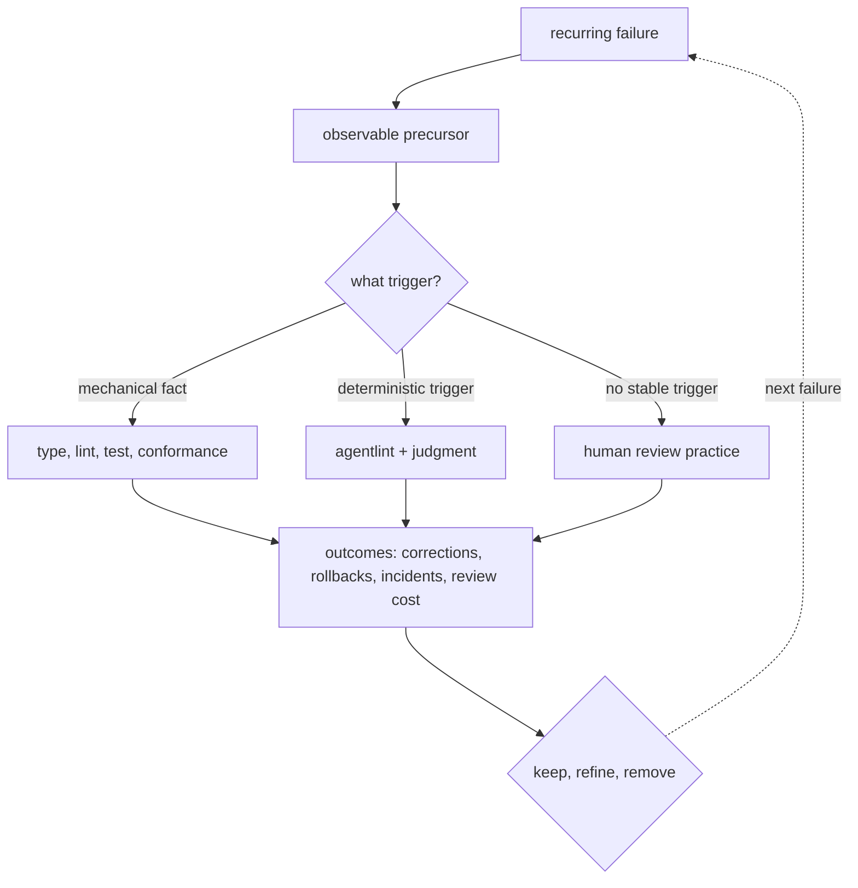
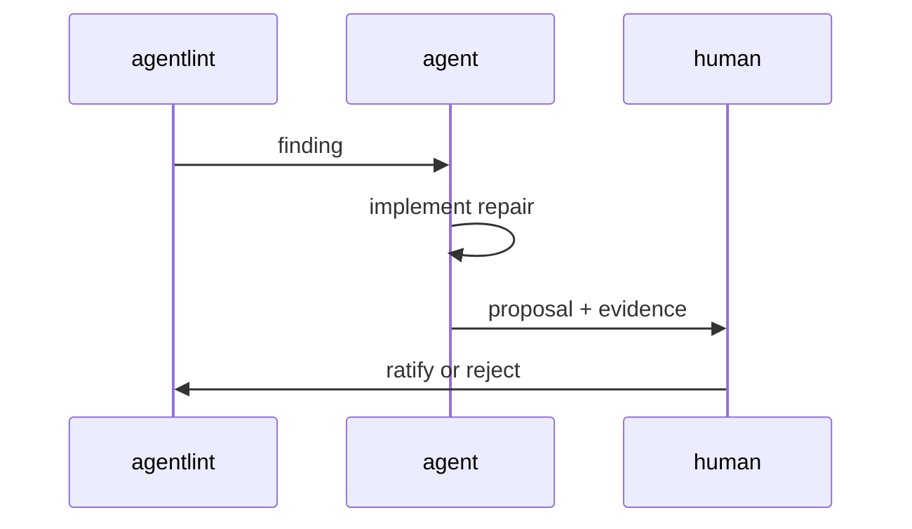

# Operating model

```text
 👤 humans ─▶ architecture · boundaries · verification strategy · what "good" means
 🤖 agents ─▶ implementation, proven against automated constraints, not reviewer patience
```

**Agent output is trusted exactly as far as evidence can falsify it.** Green constraints prove their stated contracts, not maintainability, architectural fitness, or future ease of change.

## Every concern has exactly one home

```text
 concern                                 home
 ──────────────────────────────────────  ─────────────────────────────────────────────
 invalid states                        ▶ types + schemas  (unrepresentable, not validated)   ▲ most mechanical
 forbidden patterns                    ▶ oxlint rules                                        │
 judgment with a deterministic trigger ▶ agentlint rules + resolution ledger                 │
 structure, manifests, layout          ▶ conformance suites                                  │
 behavior                              ▶ tests                                               │
 whatever remains                      ▶ the code-review skill                               ▼ most human
```

**Enforced twice is one home too many. Enforced only in prose is not enforced.**

## Every recurring failure feeds a learning loop



**Review cuts repeated discovery cost, not judgment.** Stable, falsifiable parts move down the table.

## Human review guards 7 things

```text
 design   architecture + module boundaries
          abstraction that clarifies the expected change vs merely moves code
          novel interactions, local conceptual coherence
          comprehensible to the people who will own it
 🔒 risk  irreversible ops: migrations, deletions, releases
          security boundaries
          public contracts
```

Only where consequences are material and no mechanical verdict exists; agentlint may schedule it, never answer it.

## Agents repair, humans ratify

```text
 🤖 agent may accept   explicit bound · existing contract test · concrete caller guarantee   (locally verifiable evidence)
 👤 human must accept  architecture · privacy · destructive ops · public contracts · invariant exceptions
```



## Maintainability shows up late, so record it late

```text
 finding ──▶ decision ──▶ … weeks later …
                           ├─ ✅ useful interception
                           ├─ ➖ unnecessary review
                           ├─ ❌ escaped concern
                           ├─ 🔧 corrective change
                           ├─ ⏪ rollback
                           └─ 🚨 incident
                                   │
                                   ▼
             calibration + outcome history ─▶ does the rule earn its review cost?
```

> [!IMPORTANT]
> A stored acceptance is a decision, not a prevented-defect count.
