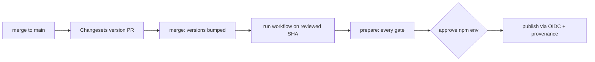
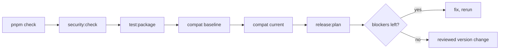

# Release and support

**Publishing runs only through one manual workflow on a reviewed `main` SHA, after every gate reruns, and after you approve the `npm` environment.** Locally, `pnpm release` / `pnpm release:plan` only print a JSON plan; unknown flags, including `--publish`, fail.



## Every package is a candidate or a draft

**[policy/release.json](../policy/release.json) classifies all 18 packages; an unlisted addition or removal fails `pnpm release:check`.**

| Class        | Count | Meaning                                                           | Boundary                                                  |
| ------------ | ----: | ----------------------------------------------------------------- | --------------------------------------------------------- |
| ✅ Candidate |    18 | Documented contracts + consumer checks. **Not stable readiness.** | Published by the release workflow.                        |
| 🧪 Draft     |     0 | Preview with a material adoption limitation.                      | `private: true` required; selecting it for release fails. |

No drafts today. A future draft packs and tests locally; **candidates' runtime, optional, and peer dependencies cannot require one.** Parked outside the repo: 4 Shopify theme packages, both Lit plugins, `oio`.

<details>
<summary>How Changesets treats private drafts</summary>

Changesets versions private packages (`privatePackages.version: true`) so mixed changesets and changelogs stay useful, but does not tag them (`tag: false`). `private: true` is the npm/Changesets publication boundary. `ignore` is deliberately unused: its mixed ignored/non-ignored restrictions would reject existing shared changesets. See [Changesets configuration](https://changesets.dev/guide/config).

</details>

## Five gates, then read the plan



```sh
pnpm release:plan                                          # all candidates
pnpm release:plan --package @aurelienbbn/oxlint-plugin-core  # a subset
```

Reports commit, dirty state, candidate versions, draft exclusions, blockers. **A successful plan means a valid inventory, not resolved blockers.** Packages stay `0.0.0` until the version PR merges; publishing refuses `0.0.0` and prereleases.

## Three workflows, one publishes

```text
ci.yml       CI               PR · push to main · manual  ─▶ 8 legs ─▶ Validate
publish.yml  Prepare and      manual, main only           ─▶ reruns every gate on a reviewed SHA, prints plan,
             publish release                              ─▶ then, after npm-environment approval, publishes
release.yml  Release          push to main                ─▶ release:check, then Changesets version PR
```

```text
                 Linux  Windows
Node 22            ●       ●     full suite: check, audit, test:package, both profiles
Node 24            ●       ●     full suite
Node 22.19.0       ●       ●     floor: build + both registry profiles
Node 24.11.0       ●       ●     floor: build + both registry profiles
                   └───────┴──▶  Validate: passes only if all 8 pass (existing branch-protection name)
```

Local runs don't prove remote ones. **Both release jobs reject a SHA that differs from the workflow revision or checkout**; inputs via environment variables, time-bounded jobs, serialized runs.

> [!IMPORTANT]
> **Version PRs don't trigger CI on their own.** Opened with `GITHUB_TOKEN`, they get approval-required runs, and their pushes start no push workflows. Approve those runs or run **CI** manually on the version branch, and require the result before merge. See [triggering workflows with GITHUB_TOKEN](https://docs.github.com/en/actions/how-tos/write-workflows/choose-when-workflows-run/trigger-a-workflow).

## Repository settings: verified vs not configured

**Canonical repo `aurelienbobenrieth/harness`, npm scope `@aurelienbbn`**; metadata and changelog links must match. ✅ security reporting, alerts, Dependabot, secret scanning, **Validate**-protected main · ⚠️ 0 required PR approvals · ✅ `npm` environment needs your approval · ❌ npm trusted publishers not configured yet.

<details>
<summary>Settings evidence</summary>

| Setting                                      | State             | Evidence                                  |
| -------------------------------------------- | ----------------- | ----------------------------------------- |
| canonical repository                         | ✅                | GitHub, 2026-09-05                        |
| private vulnerability reporting              | ✅ enabled        | GitHub API, 2026-09-21                    |
| vulnerability alerts                         | ✅ enabled        | GitHub API, 2026-09-21                    |
| Dependabot security updates                  | ✅ enabled        | GitHub API, 2026-09-21                    |
| secret scanning + push protection            | ✅ unchanged      | previously verified                       |
| main protection: fresh **Validate** required | ✅                | GitHub API, 2026-09-21                    |
| main protection includes administrators      | ✅                | GitHub API, 2026-09-21                    |
| required approvals                           | ⚠️ 0              | one collaborator, also the sole CODEOWNER |
| npm trusted publishers (18 candidates)       | ❌ not configured | needs npmjs.com access                    |
| `npm` environment: required reviewer         | ✅ owner          | GitHub API, 2026-09-24                    |
| `npm` environment: protected branches only   | ✅                | GitHub API, 2026-09-24                    |

- Zero PR approvals is deliberate: with one collaborator, a required independent approval blocks routine maintenance. The `npm` environment approval gates publishing instead. Revisit before adding maintainers.
- CODEOWNERS records ownership; it adds no independent reviewer.
- Checked-in Dependabot config schedules weekly npm and GitHub Actions PRs on the default branch; the repo setting allows vulnerability-driven ones. Neither proves a future run succeeded.

</details>

## Before the first publish

- [ ] On npmjs.com, add a trusted publisher to each candidate: repository `aurelienbobenrieth/harness`, workflow `publish.yml`, environment `npm`.
- [ ] If npm won't attach a trusted publisher to a package that doesn't exist yet, publish once locally: `npm login`, merge the version PR, then `node scripts/publish.mjs` on a clean `main` (no provenance locally).

`scripts/publish.mjs` publishes only candidates, skips versions already on npm (safe to rerun), packs with pnpm, and publishes with `--access public` plus `--provenance` in CI. **No npm token is stored anywhere.**

## Every action is pinned to a commit

**Pinning freezes the revision; it doesn't audit the action or its downloads.** YAML policy checks catch drift; they don't sandbox shell commands or replace workflow review.

<details>
<summary>Pins and rejected drift</summary>

Resolved from each action's canonical repository on 2026-09-25, annotated tags peeled to commits:

| Action             | Release | Commit                                     |
| ------------------ | ------- | ------------------------------------------ |
| actions/checkout   | v7.0.1  | `3d3c42e5aac5ba805825da76410c181273ba90b1` |
| actions/setup-node | v7.0.0  | `820762786026740c76f36085b0efc47a31fe5020` |
| pnpm/action-setup  | v6.1.0  | `ea17c68df8912ef543352723c149a84f56e3d413` |
| changesets/action  | v2.1.2  | `ae32849d5ba541f9ae29e40e22a623bc13562f51` |

Rejected: mutable action references · unexpected token permissions (`id-token: write` only on the publish job) · a publish job without the `npm` environment, preparation, or SHA verification · publish commands outside `scripts/publish.mjs` · persisted checkout credentials outside the version writer · stored release secrets · skipped aggregate checks · ignored validation failures, including via expressions · excluded runtime matrix legs · runtime setup not using the matrix · a Changesets publishing input · the version PR writer invoking Changesets before its release-policy gate.

GitHub guidance: [immutable references and least privilege](https://docs.github.com/en/actions/reference/security/secure-use), [workflow failure controls](https://docs.github.com/en/actions/reference/workflows-and-actions/workflow-syntax#jobsjob_idstepscontinue-on-error).

</details>

## Support covers latest source and tested profiles only

✅ latest source · ✅ tool profiles exercised by consumer tests · ❌ future tool majors · ❌ enterprise SLA · ❌ historical security backports. Updates pass the same validation as any change; preview dependencies state provenance and compatibility.

Defects: [issues](https://github.com/aurelienbobenrieth/harness/issues) · Vulnerabilities: [SECURITY.md](../SECURITY.md)
