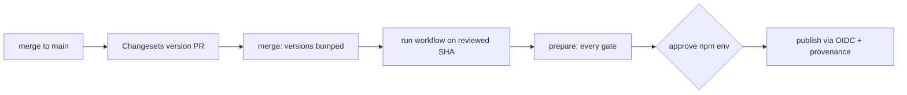
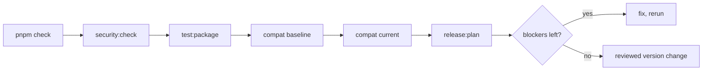

# Release and support

**Publishing runs only through one manual workflow on a reviewed `main` SHA, after every gate reruns, and after you approve the `npm` environment.** Locally, `pnpm release` / `pnpm release:plan` only print a JSON plan; unknown flags, including `--publish`, fail.


```mermaid
flowchart LR
  M["merge to main"] --> V["Changesets version PR"]
  V --> MV["merge: versions bumped"]
  MV --> W["run workflow on reviewed SHA"]
  W --> G["prepare: every gate"]
  G --> A{"approve npm env"}
  A --> N["publish via OIDC + provenance"]
```

## Every package is a candidate or a draft

**[policy/release.json](../policy/release.json) classifies all 21 packages; an unlisted addition or removal fails `pnpm release:check`.**

| Class        | Count | Meaning                                                           | Boundary                                                  |
| ------------ | ----: | ----------------------------------------------------------------- | --------------------------------------------------------- |
| ✅ Candidate |    21 | Documented contracts + consumer checks. **Not stable readiness.** | Published by the release workflow.                        |
| 🧪 Draft     |     0 | Preview with a material adoption limitation.                      | `private: true` required; selecting it for release fails. |

No drafts today. A future draft packs and tests locally; **candidates' runtime, optional, and peer dependencies cannot require one.** Parked outside the repo: 4 Shopify theme packages, both Lit plugins, `oio`.

<details>
<summary>How Changesets treats private drafts</summary>

Changesets versions private packages (`privatePackages.version: true`) so mixed changesets and changelogs stay useful, but does not tag them (`tag: false`). `private: true` is the npm/Changesets publication boundary. `ignore` is deliberately unused: its mixed ignored/non-ignored restrictions would reject existing shared changesets. See [Changesets configuration](https://changesets.dev/guide/config).

</details>

## Five gates, then read the plan


```mermaid
flowchart LR
  C["pnpm check"] --> S["security:check"]
  S --> P["test:package"]
  P --> B["compat baseline"]
  B --> U["compat current"]
  U --> R["release:plan"]
  R --> H{"blockers left?"}
  H -- yes --> F["fix, rerun"]
  H -- no --> V["reviewed version change"]
```

```sh
pnpm release:plan                                          # all candidates
pnpm release:plan --package @aurelienbbn/oxlint-plugin-core  # a subset
```

Reports commit, dirty state, candidate versions, draft exclusions, blockers. **A successful plan means a valid inventory, not resolved blockers.** Packages stay `0.0.0` until the version PR merges; publishing refuses `0.0.0` and prereleases.

## Three workflows, one publishes

```text
ci.yml       CI               push to main · manual       ─▶ 8 legs ─▶ Validate
                               PR                          ─▶ 2 legs, affected packages ─▶ Validate
publish.yml  Prepare and      manual, main only           ─▶ reruns every gate on a reviewed SHA, prints plan,
             publish release                              ─▶ then, after npm-environment approval, publishes
release.yml  Release          push to main                ─▶ release:check, then Changesets version PR
```

```text
                 Linux  Windows
Node 22            ●       ●     full suite: check, audit, test:package, both profiles     push, manual
Node 24            ●       ●     full suite                                                 every event
Node 22.19.0       ●       ●     floor: build + both registry profiles                     push, manual
Node 24.11.0       ●       ●     floor: build + both registry profiles                     push, manual
                   └───────┴──▶  Validate: passes only if every leg the event runs passes (existing
                                 branch-protection name); floors may be skipped only on a PR
```

**Pull requests trade coverage for speed; main catches the rest.** A PR runs Node 24 on both systems, and `pnpm check` narrows typecheck and unit tests to the packages changed since the merge base, plus their dependents (`HARNESS_AFFECTED_BASE`). A change outside `packages/` and `internal/`, other than docs, skills, changesets or root Markdown, runs the full suite. Lint, format, catalog, policy checks, audit, `test:package` and both registry profiles always cover the whole repo. A Node 22-only or runtime-floor break, or an undeclared cross-package break, surfaces on the push to main: **check main's CI before running the publish workflow.**

Local runs don't prove remote ones. **Both release jobs reject a SHA that differs from the workflow revision or checkout**; inputs via environment variables, time-bounded jobs, serialized runs.

> [!IMPORTANT]
> **Version PRs trigger CI on their own only once the release App is set up.** `release.yml` writes the version PR with the App's token when `RELEASE_APP_CLIENT_ID` and `RELEASE_APP_PRIVATE_KEY` exist, and falls back to `GITHUB_TOKEN` otherwise. Events from `GITHUB_TOKEN` start no workflows ([why](https://docs.github.com/en/actions/how-tos/write-workflows/choose-when-workflows-run/trigger-a-workflow)): until the App exists, run **CI** manually on the version branch and require the result before merge.

<details>
<summary>One-time release App setup</summary>

1. Create a GitHub App under your account (Settings → Developer settings → GitHub Apps → New). No webhook, no callback URL. Repository permissions: **Contents: read and write**, **Pull requests: read and write**; metadata read is implied. Installable only on this account.
2. Install it on `aurelienbobenrieth/harness` only.
3. Copy its **Client ID** and generate a **private key** (`.pem`).
4. Add repository secrets `RELEASE_APP_CLIENT_ID` (the Client ID) and `RELEASE_APP_PRIVATE_KEY` (the whole `.pem`).
5. Merge a change with a changeset: the version PR is authored by the App and its **Validate** check starts without approval.

The token is minted after `pnpm release:check`, scoped to contents and pull-requests write, and revoked when the job ends. It never reaches npm; publishing still needs the `npm` environment approval.

</details>

## Repository settings: verified vs not configured

**Canonical repo `aurelienbobenrieth/harness`, npm scope `@aurelienbbn`**; metadata and changelog links must match. ✅ security reporting, alerts, Dependabot, secret scanning, **Validate**-protected main · ⚠️ 0 required PR approvals · ✅ `npm` environment needs your approval · ✅ npm trusted publishing proven on 9 packages · ⚠️ 12 never published through it yet · ❌ release App not configured yet.

<details>
<summary>Settings evidence</summary>

| Setting                                      | State             | Evidence                                                                  |
| -------------------------------------------- | ----------------- | ------------------------------------------------------------------------- |
| canonical repository                         | ✅                | GitHub, 2026-09-05                                                        |
| private vulnerability reporting              | ✅ enabled        | GitHub API, 2026-09-30                                                    |
| vulnerability alerts                         | ✅ enabled        | GitHub API, 2026-09-30                                                    |
| Dependabot security updates                  | ✅ enabled        | GitHub API, 2026-09-30                                                    |
| secret scanning + push protection            | ✅ enabled        | GitHub API, 2026-09-30                                                    |
| main protection: fresh **Validate** required | ✅                | GitHub API, 2026-09-30                                                    |
| main protection includes administrators      | ✅                | GitHub API, 2026-09-30                                                    |
| required approvals                           | ⚠️ 0              | one collaborator, also the sole CODEOWNER                                 |
| npm trusted publishing (OIDC)                | ✅ 9 of 21        | npm lists GitHub Actions as publisher of their latest version, 2026-09-30 |
| trusted publisher on the other 12            | ⚠️ unverified     | every release predates OIDC; needs npmjs.com access                       |
| npm token secrets (repo and `npm` env)       | ✅ none           | GitHub API, 2026-09-30                                                    |
| release App secrets for version PRs          | ❌ not configured | GitHub API, 2026-09-30; needs the App, see above                          |
| `npm` environment: required reviewer         | ✅ owner          | GitHub API, 2026-09-30                                                    |
| `npm` environment: protected branches only   | ✅                | GitHub API, 2026-09-30                                                    |

- Zero PR approvals is deliberate: with one collaborator, a required independent approval blocks routine maintenance. The `npm` environment approval gates publishing instead. Revisit before adding maintainers.
- CODEOWNERS records ownership; it adds no independent reviewer.
- Checked-in Dependabot config schedules weekly npm and GitHub Actions PRs on the default branch; the repo setting allows vulnerability-driven ones. Neither proves a future run succeeded.

</details>

## Trusted publishing works; 12 packages haven't used it yet

**[Publish run 36713205571](https://github.com/aurelienbobenrieth/harness/actions/runs/36713205571) (2026-09-30) published 7 packages over OIDC with provenance, with no npm token in the repo or the `npm` environment.** `oxlint-config` and `oxfmt-config` were already publishing the same way.

- Latest version published over OIDC: the 6 `agentlint-plugin-*`, `oxlint-plugin-effect`, `oxlint-config`, `oxfmt-config`.
- Every release published locally, trusted publisher unverified: the 4 `conformance-*` and `oxlint-plugin-alchemy`, `-cloudflare`, `-core`, `-drizzle`, `-shopify-app`, `-tanstack-query`, `-type-evidence`, `-xstate`.

- [ ] Before a release that includes one of the 12, confirm on npmjs.com that it has a trusted publisher: repository `aurelienbobenrieth/harness`, workflow `publish.yml`, environment `npm`. Without one, the workflow has no npm credential for it.
- [ ] A new package that doesn't exist on npm yet: if npm won't attach a trusted publisher to it, publish it once locally (`npm login`, merge the version PR, then `node scripts/publish.mjs` on a clean `main`, no provenance locally), then add the trusted publisher.

`scripts/publish.mjs` publishes only candidates, skips versions already on npm (safe to rerun), packs with pnpm, and publishes with `--access public` plus `--provenance` in CI. **No npm token is stored anywhere.**

## Every action is pinned to a commit

**Pinning freezes the revision; it doesn't audit the action or its downloads.** YAML policy checks catch drift; they don't sandbox shell commands or replace workflow review.

<details>
<summary>Pins and rejected drift</summary>

Resolved from each action's canonical repository on 2026-09-25 (create-github-app-token on 2026-09-30), annotated tags peeled to commits:

| Action                          | Release | Commit                                     |
| ------------------------------- | ------- | ------------------------------------------ |
| actions/checkout                | v7.0.1  | `3d3c42e5aac5ba805825da76410c181273ba90b1` |
| actions/setup-node              | v7.0.0  | `820762786026740c76f36085b0efc47a31fe5020` |
| pnpm/action-setup               | v6.1.0  | `ea17c68df8912ef543352723c149a84f56e3d413` |
| changesets/action               | v2.1.2  | `ae32849d5ba541f9ae29e40e22a623bc13562f51` |
| actions/create-github-app-token | v3.2.0  | `bcd2ba49218906704ab6c1aa796996da409d3eb1` |

Rejected: mutable action references · unexpected token permissions (`id-token: write` only on the publish job) · a publish job without the `npm` environment, preparation, or SHA verification · publish commands outside `scripts/publish.mjs` · persisted checkout credentials outside the version writer · stored secrets other than the release App credentials, which only its token step reads · an App token minted before the release-policy gate or beyond contents and pull-requests write · skipped aggregate checks · runtime floors skipped outside pull requests · affected-only validation outside pull requests or in release preparation · ignored validation failures, including via expressions · excluded runtime matrix legs · runtime setup not using the matrix · a Changesets publishing input · the version PR writer invoking Changesets before its release-policy gate.

GitHub guidance: [immutable references and least privilege](https://docs.github.com/en/actions/reference/security/secure-use), [workflow failure controls](https://docs.github.com/en/actions/reference/workflows-and-actions/workflow-syntax#jobsjob_idstepscontinue-on-error).

</details>

## Support covers latest source and tested profiles only

✅ latest source · ✅ tool profiles exercised by consumer tests · ❌ future tool majors · ❌ enterprise SLA · ❌ historical security backports. Updates pass the same validation as any change; preview dependencies state provenance and compatibility.

Defects: [issues](https://github.com/aurelienbobenrieth/harness/issues) · Vulnerabilities: [SECURITY.md](../SECURITY.md)
