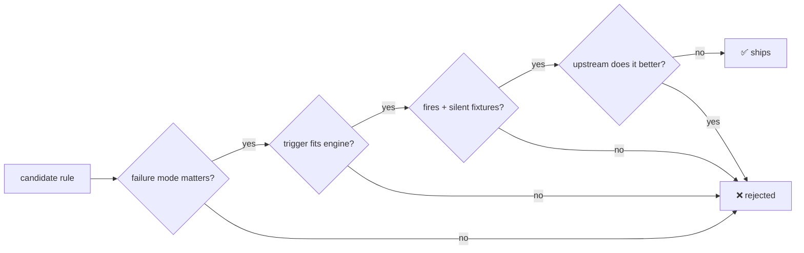

# Rule ownership

**A rule ships only when it names the behavior it owns and no maintained upstream tool enforces it better.**



**`pnpm catalog:check` enforces two-sided fixtures on all 176 rules and 28 checks.** A rule missing from its README's generated inventory can't ship.

```text
 oxlint-plugin-effect            ███████████████████████████████████ 35
 oxlint-plugin-shopify-app       ███████████████████████████        27
 agentlint-plugin-core           ████████████████████████           24
 oxlint-plugin-core              ████████████████                   16
 agentlint-plugin-shopify-app    ███████████████                    15
 oxlint-plugin-xstate            ███████████                        11
 oxlint-plugin-type-evidence     ██████████                         10
 oxlint-plugin-tanstack-query    ████████                            8
 oxlint-plugin-cloudflare        ███████                             7
 agentlint-plugin-alchemy        ██████                              6
 agentlint-plugin-xstate         █████                               5
 agentlint-plugin-tanstack-query ████                                4
 oxlint-plugin-alchemy           ████                                4
 agentlint-plugin-effect         ███                                 3
 oxlint-plugin-drizzle           █                                   1
                                                        rules  = 176
 conformance-shopify-app         █████████████                      13
 conformance-cloudflare          ██████                              6
 conformance-core                █████                               5
 conformance-alchemy             ████                                4
                                                        checks =  28
```

## Upstream owns the engine, Harness owns the delta

| Upstream owner                                                                               | Harness delta                                                                                                                                                                                                                                                                                                                           |
| -------------------------------------------------------------------------------------------- | --------------------------------------------------------------------------------------------------------------------------------------------------------------------------------------------------------------------------------------------------------------------------------------------------------------------------------------- |
| Oxlint built-ins + TypeScript                                                                | Conventions the strict preset can't express; the preset itself.                                                                                                                                                                                                                                                                         |
| Oxlint `import/no-cycle`, `import/no-self-import`, `eslint/no-restricted-imports`            | `withImportGraphLayer` (cycles), `layerDirectionOverride` (real direction). **No second graph engine.**                                                                                                                                                                                                                                 |
| Knip                                                                                         | `dead-exports` runs it, validates the report. **No reachability analysis.**                                                                                                                                                                                                                                                             |
| jscpd                                                                                        | `duplication-budget`: clone budget + evidence failure. **No clone detection.**                                                                                                                                                                                                                                                          |
| TypeScript resolved config                                                                   | `tsconfig-strictness`: resolved flags, explicit waivers.                                                                                                                                                                                                                                                                                |
| `@effect/tsgo`                                                                               | Only syntax and org policy it doesn't own; `withEffectTsgoLayer` wires and settles it.                                                                                                                                                                                                                                                  |
| `@tanstack/eslint-plugin-query`                                                              | Official rules; `query-fn-returns-value` is a syntactic fallback (typed rule can't run via Oxlint JS plugins).                                                                                                                                                                                                                          |
| XState runtime/types + editor tooling                                                        | Lifecycle, persistence, state-model policies with no CI lint equivalent.                                                                                                                                                                                                                                                                |
| Shopify schemas, CLI, types, guidance                                                        | Cross-file contracts, finite AST checks. **No browser, copy, accessibility, or visual claims.**                                                                                                                                                                                                                                         |
| Wrangler (`types --check`, config validation, deploy), workerd, typed `no-floating-promises` | Runtime traps that compile and deploy: module-scope clients and state, detached `ctx` methods, Durable Object init, Workflow determinism, SQL binding, `mysql2` `disableEval`, timing-safe secret compare; config contracts for dates, logs, secrets, environments, Hyperdrive. **No schema, binding-existence, or `Env`-type checks.** |
| Alchemy engine (`alchemy plan`, `drift`, provider diffs, state store)                        | Phase traps that deploy cleanly: `Config` read only at runtime, instance-scope finalizers on workerd, plaintext secrets in Worker `env`, Workflow I/O outside `task`; review gates for replacement, removal policy, state store and adoption; state, CI, preview and pin contracts. **No provider diff re-implementation.**             |
| drizzle-kit, eslint-plugin-drizzle, Postgres                                                 | `fk-column-indexed` only (Postgres; InnoDB indexes foreign keys itself). **No WHERE-less update/delete rules.**                                                                                                                                                                                                                         |
| Agentlint detector contract                                                                  | Review prompts; peer on the public engine 0.3.x.                                                                                                                                                                                                                                                                                        |

<details>
<summary>Delta details</summary>

- `dead-exports` also maps unavailable/malformed Knip evidence into the shared report model.
- `tsconfig-strictness` checks resolved flags across a workspace.
- TanStack Query local rules exist only where they review a different architecture or UI-state contract.
- Agentlint prompts target architecture and semantic risks, deliberately not compiler-style certainty.
- Skott is for dependency visualization; dependency-cruiser is stronger for rich graph policies.

</details>

## 14 Effect rules cut: 8 owned by tsgo and the strict preset, 3 need the layer, 3 have no exact owner

`@effect/tsgo` 0.45.0's `recommended` oxlint preset alone doesn't cover every removal. `withEffectTsgoLayer` (`@aurelienbbn/oxlint-config`) turns on the four off-by-default diagnostics below.

| Removed rule                                            | tsgo owner                                                                                                                            | Wired by                         |
| ------------------------------------------------------- | ------------------------------------------------------------------------------------------------------------------------------------- | -------------------------------- |
| `no-floating-effect`                                    | `floating-effect`                                                                                                                     | ✅ `recommended`                 |
| `no-plain-yield`                                        | `missing-star-in-yield-effect-gen`                                                                                                    | ✅ `recommended`                 |
| `require-return-on-failure-yield`                       | `missing-return-yield-star`                                                                                                           | ✅ `recommended`                 |
| `prefer-effect-fn`                                      | `effect-fn-opportunity`                                                                                                               | ✅ `recommended`                 |
| `no-raw-json-parse`, `no-raw-json-stringify`            | `prefer-schema-over-json`                                                                                                             | ✅ `recommended`                 |
| `no-ambient-nondeterminism`                             | `global-date*`, `global-random*`, `crypto-random-uuid*`                                                                               | ✅ `recommended`                 |
| `no-effect-type-assertion`                              | `unsafe-effect-type-assertion`                                                                                                        | ⚠️ `withEffectTsgoLayer` only    |
| `no-unsafe-error-channel`                               | `any-unknown-in-error-context`                                                                                                        | ⚠️ `withEffectTsgoLayer` only    |
| `matching-identifier`                                   | `deterministic-keys` (+ `class-self-mismatch`, in `recommended`)                                                                      | ⚠️ `withEffectTsgoLayer` only    |
| `no-nested-layer-provide`, `no-cascading-layer-provide` | none exact: `multiple-effect-provide` and `strict-effect-provide` target `Effect.provide`, not `Layer.provide` nesting                | ❌ uncovered                     |
| `use-root-imports`                                      | none: tsgo has no import-path diagnostic                                                                                              | ❌ uncovered                     |
| `prefer-schema-decode-unknown`                          | `prefer-schema-over-json` for `JSON.parse`; Effect 4 typed decoders reject `unknown` input; `typescript/no-explicit-any` for `as any` | ✅ `recommended` + strict preset |

`no-unsafe-effect-body` stays, trimmed to its `throw` check: `try-catch-in-effect-gen` and `global-timers-in-effect` (both `recommended`) own the rest. Every remaining overlap with a Harness rule is settled in `withEffectTsgoLayer`'s table (`packages/oxlint-config/README.md`).

> [!WARNING]
> **The three uncovered removals are open gaps, not ownership.** Re-ship them or request `Layer.provide` coverage upstream in Effect-TS/tsgo.

> [!NOTE]
> Ownership audit, not usage evidence. Post-adoption false-positive, suppression, and finding rates decide which opinionated rules survive.

## Oxlint import rules are the only graph gate

Cycles + declared layers, repo and strict config. Skott and dependency-cruiser: no merge gate needed today. **Adopt dependency-cruiser when a consumer needs** transitive forbidden paths, orphan analysis beyond Knip, or an architecture graph `no-restricted-imports` can't express.
