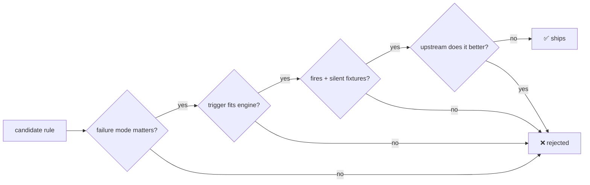

# Rule ownership

**A rule ships only when it names the behavior it owns and no maintained upstream tool enforces it better.**



**`pnpm catalog:check` enforces two-sided fixtures on all 153 rules and 15 checks.** A rule missing from its README's generated inventory can't ship.

```text
 oxlint-plugin-effect            ████████████████████████████████  32
 oxlint-plugin-shopify-app       ███████████████████████████       27
 agentlint-plugin-core           ████████████████████████          24
 oxlint-plugin-core              ███████████████                   15
 agentlint-plugin-shopify-app    ██████████████                    14
 oxlint-plugin-xstate            ███████████                       11
 oxlint-plugin-type-evidence     ██████████                        10
 oxlint-plugin-tanstack-query    ████████                           8
 agentlint-plugin-xstate         █████                              5
 agentlint-plugin-tanstack-query ████                               4
 agentlint-plugin-effect         ███                                3
                                                        rules  = 153
 conformance-shopify-app         ██████████                        10
 conformance-core                █████                              5
                                                        checks =  15
```

## Upstream owns the engine, Harness owns the delta

| Upstream owner                                                                    | Harness delta                                                                                                  |
| --------------------------------------------------------------------------------- | -------------------------------------------------------------------------------------------------------------- |
| Oxlint built-ins + TypeScript                                                     | Conventions the strict preset can't express; the preset itself.                                                |
| Oxlint `import/no-cycle`, `import/no-self-import`, `eslint/no-restricted-imports` | `withImportGraphLayer` (cycles), `layerDirectionOverride` (real direction). **No second graph engine.**        |
| Knip                                                                              | `dead-exports` runs it, validates the report. **No reachability analysis.**                                    |
| jscpd                                                                             | `duplication-budget`: clone budget + evidence failure. **No clone detection.**                                 |
| TypeScript resolved config                                                        | `tsconfig-strictness`: resolved flags, explicit waivers.                                                       |
| `@effect/tsgo`                                                                    | Only syntax and org policy it doesn't own.                                                                     |
| `@tanstack/eslint-plugin-query`                                                   | Official rules; `query-fn-returns-value` is a syntactic fallback (typed rule can't run via Oxlint JS plugins). |
| XState runtime/types + editor tooling                                             | Lifecycle, persistence, state-model policies with no CI lint equivalent.                                       |
| Shopify schemas, CLI, types, guidance                                             | Cross-file contracts, finite AST checks. **No browser, copy, accessibility, or visual claims.**                |
| Agentlint detector contract                                                       | Review prompts; private until a compatible engine ships.                                                       |

<details>
<summary>Delta details</summary>

- `dead-exports` also maps unavailable/malformed Knip evidence into the shared report model.
- `tsconfig-strictness` checks resolved flags across a workspace.
- TanStack Query local rules exist only where they review a different architecture or UI-state contract.
- Agentlint prompts target architecture and semantic risks, deliberately not compiler-style certainty.
- Skott is for dependency visualization; dependency-cruiser is stronger for rich graph policies.

</details>

## 13 Effect rules cut: typed diagnostics own them

<details>
<summary>The 13 removed rules</summary>

`matching-identifier`, `no-ambient-nondeterminism`, `no-cascading-layer-provide`, `no-effect-type-assertion`, `no-floating-effect`, `no-nested-layer-provide`, `no-plain-yield`, `no-raw-json-parse`, `no-raw-json-stringify`, `no-unsafe-error-channel`, `prefer-effect-fn`, `require-return-on-failure-yield`, `use-root-imports`

</details>

> [!NOTE]
> Ownership audit, not usage evidence. Post-adoption false-positive, suppression, and finding rates decide which opinionated rules survive.

## Oxlint import rules are the only graph gate

Cycles + declared layers, repo and strict config. Skott and dependency-cruiser: no merge gate needed today. **Adopt dependency-cruiser when a consumer needs** transitive forbidden paths, orphan analysis beyond Knip, or an architecture graph `no-restricted-imports` can't express.
